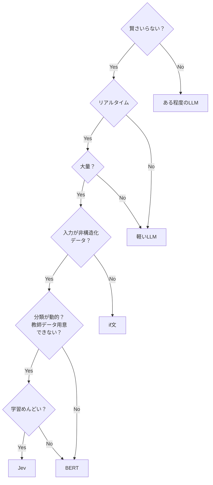

# Jevる？

入力データの性質から、利用するモデルや処理方法を選ぶための判断フローです。

## 判断の流れ

- 賢さが不要なら、ある程度のLLMを利用
- リアルタイム性が必要なら、データ量を確認
- 大量の非構造化データで分類が動的、または教師データを用意できない場合は学習の手間を確認
- 学習が面倒ならJev、そうでなければBERT
- 非構造化データでなければif文、リアルタイム性が不要なら軽いLLM
