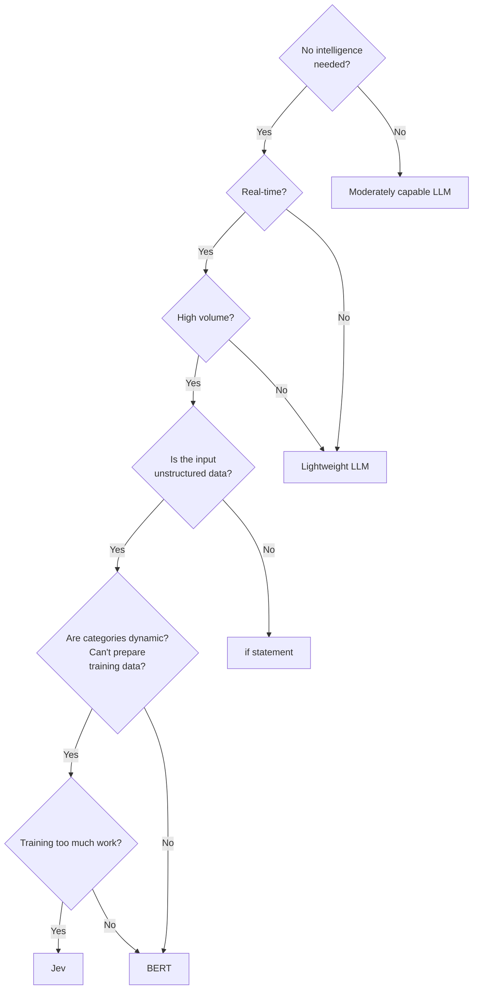

# Should You Jev?

English | [日本語](README.ja.md)

A decision flow for choosing a model or processing method based on the characteristics of the input data.

## Decision flow

- If intelligence is not required, use a moderately capable LLM.
- If real-time processing is required, check the data volume.
- For high-volume, unstructured data with dynamic categories—or when training data cannot be prepared—consider the training effort.
- If training is too much work, use Jev; otherwise, use BERT.
- Use an `if` statement for structured data, or a lightweight LLM when real-time processing is not required.
